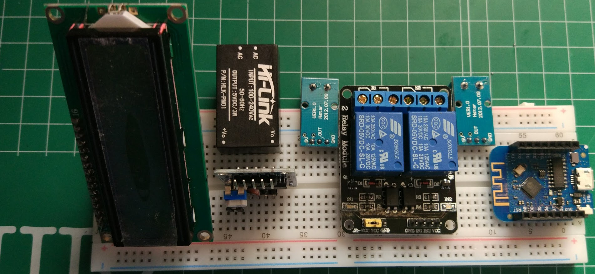

# ESPowerMeter

## v1

## v2

## Documentación

[Review de sensores de corriente](http://henrysbench.capnfatz.com/henrys-bench/arduino-current-measurements/)

[Medida de AC con acs712](http://henrysbench.capnfatz.com/henrys-bench/acs712-arduino-ac-current-tutorial/)

[Tutorial INA219 (mide voltaje y corriente)](https://learn.adafruit.com/build-a-cloud-connected-esp8266-power-meter?view=all)

[Referencia INA219](https://learn.adafruit.com/adafruit-ina219-current-sensor-breakout?view=all)

## Proyectos

[Proyecto de medidor de consumo con ESP](https://github.com/jaminNZx/ESP8266-Power-Monitor/blob/master/ESP8266-Power-Monitor.ino)
